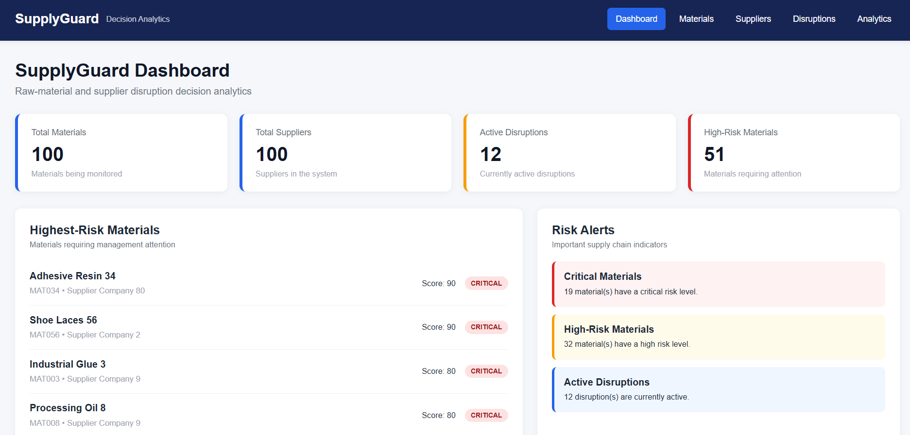
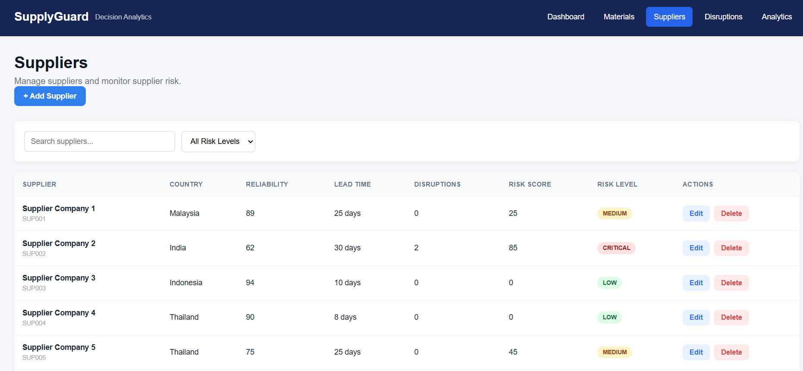
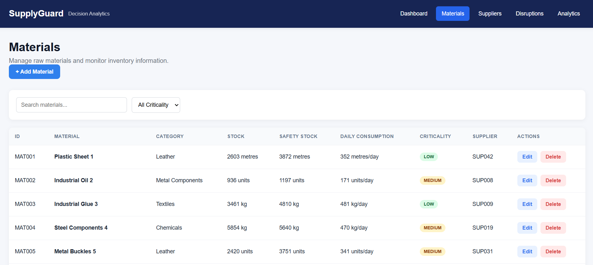
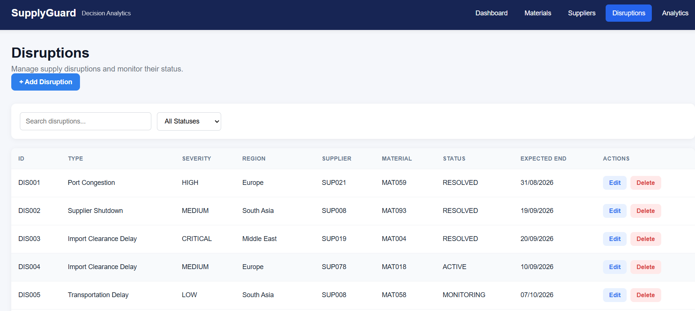
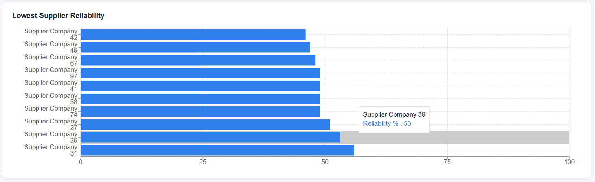

# SupplyGuard – Raw Material & Supplier Disruption Decision Analytics System

## Overview

SupplyGuard is a full-stack supply-chain analytics application designed to support decision-making around raw material availability, supplier risks, inventory levels, and potential supply disruptions.

The application combines a rule-based risk scoring system with an interactive dashboard to help users identify potential risks and analyse supply-chain conditions.

## Key Features

* **Supplier Risk Analysis:** Assess supplier-related risks using a rule-based scoring system.
* **Inventory Analysis:** Review inventory information to support raw material availability decisions.
* **Disruption Analysis:** Analyse potential supply-chain disruptions using application-defined rules.
* **Interactive Dashboard:** Present supply-chain information and risk indicators in a user-friendly interface.
* **REST API:** Provide CRUD operations for managing application data.
* **Database Queries and Aggregation:** Use MongoDB queries and aggregation to retrieve and analyse data.

## Technology Stack

* **Frontend:** React
* **Backend:** Node.js, Express
* **Database:** MongoDB
* **API:** REST

## Architecture

The application follows a full-stack architecture:

1. The React frontend provides the user interface and analytics dashboard.
2. The Express backend exposes REST API endpoints.
3. Node.js handles application logic and risk-scoring rules.
4. MongoDB stores the application data and supports queries and aggregation.

## Getting Started

### Prerequisites

* Node.js and npm
* MongoDB or an authorised MongoDB deployment
* Git

### Installation

1. Clone the repository:

   `git clone https://github.com/Sashmitha2/SupplyGuard.git`

2. Navigate to the project directory:

   `cd SupplyGuard`

3. Install dependencies in the frontend and backend directories, using the appropriate `package.json` files.

4. Configure the required environment variables in local environment files. Do not commit credentials or secrets.

5. Start the backend and frontend using the scripts defined in their respective `package.json` files.

### Configuration

Document the actual environment variables required by the application in an `.env` file, using placeholder values only.

## Learning Outcomes

This project provided practical experience with full-stack application development, REST API design, MongoDB data modelling and aggregation, rule-based analytics, and interactive dashboard development.

## Future Improvements

* Add automated tests for API endpoints and risk-scoring rules.
* Implement structured application logging and health checks.
* Introduce automated CI workflows for testing.
* Improve monitoring and error handling.

## Application Screenshots

### Dashboard

### Supplier Management

### Materials and Inventory

### Disruption Monitoring

### Analytics

.png)
.png)
.png)

## Author

Sashmitha Jayaseelan
